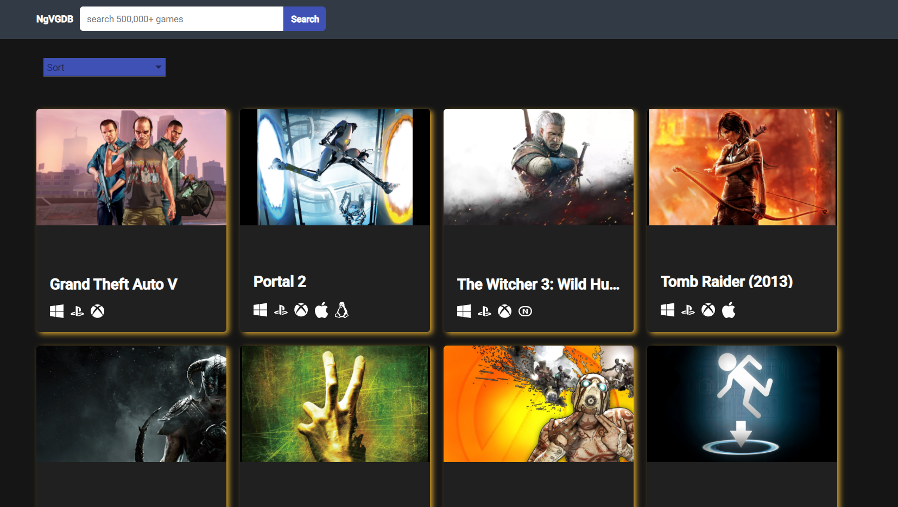
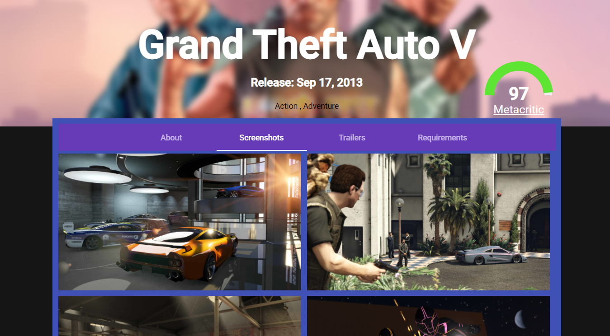
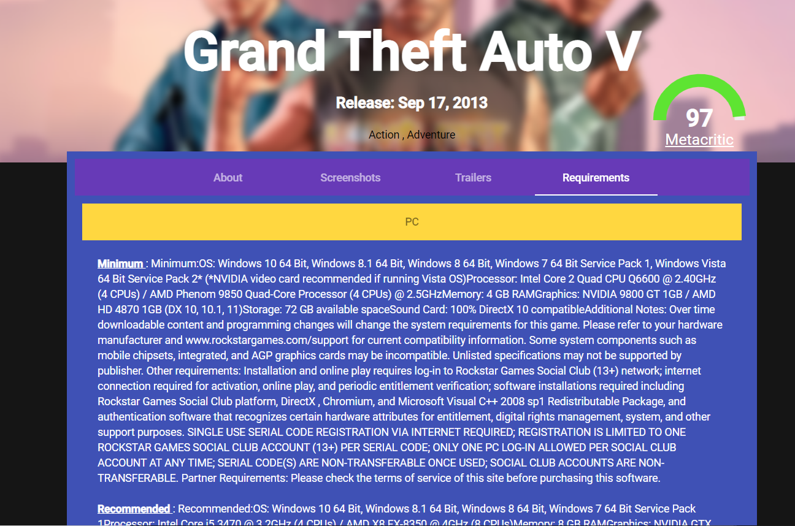

# Games Quick Start APP

This project was generated with [Angular CLI](https://github.com/angular/angular-cli) version 11.2.5.

## Description
This is a quick start application to shows games and filter them by name, release date, created date, rating, updated ... 
It's allows you to search for games by name and check all infos related to each game. 

## Development server

Run `ng serve` for a dev server. Navigate to `http://localhost:4200/`. The app will automatically reload if you change any of the source files.

## Build

Run `ng build` to build the project. The build artifacts will be stored in the `dist/` directory. Use the `--prod` flag for a production build.

## Running unit tests

Run `ng test` to execute the unit tests via [Karma](https://karma-runner.github.io).

## Running end-to-end tests

Run `ng e2e` to execute the end-to-end tests via [Protractor](http://www.protractortest.org/).
